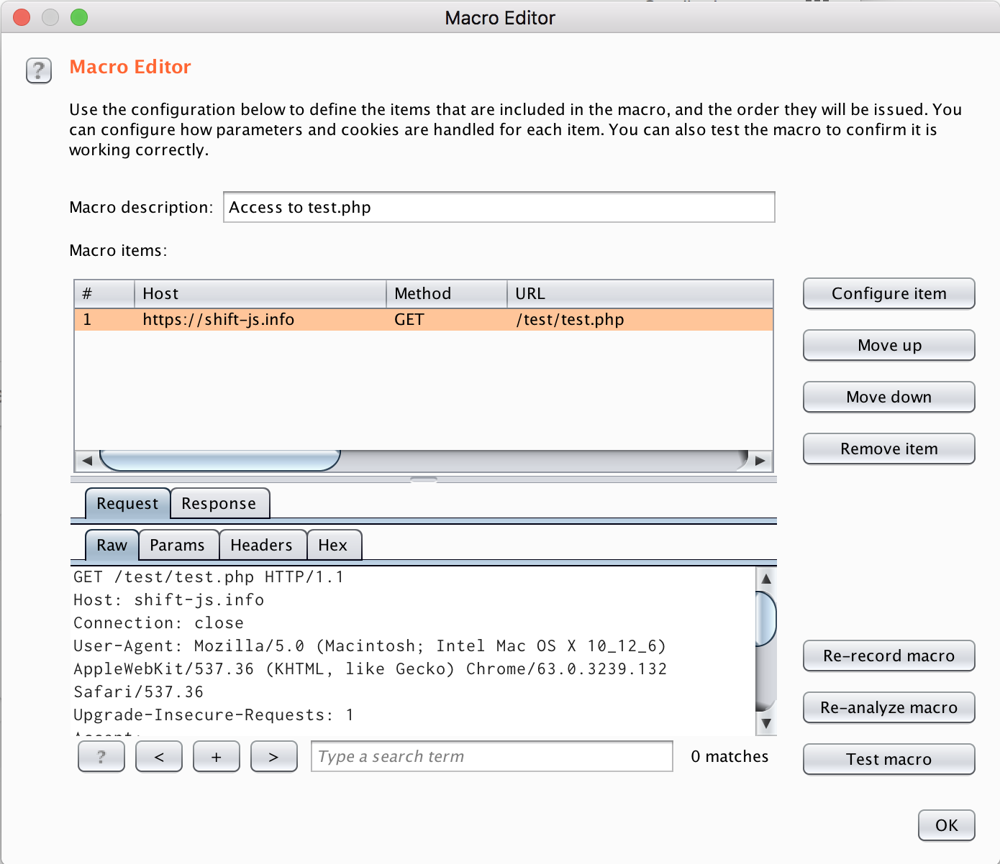
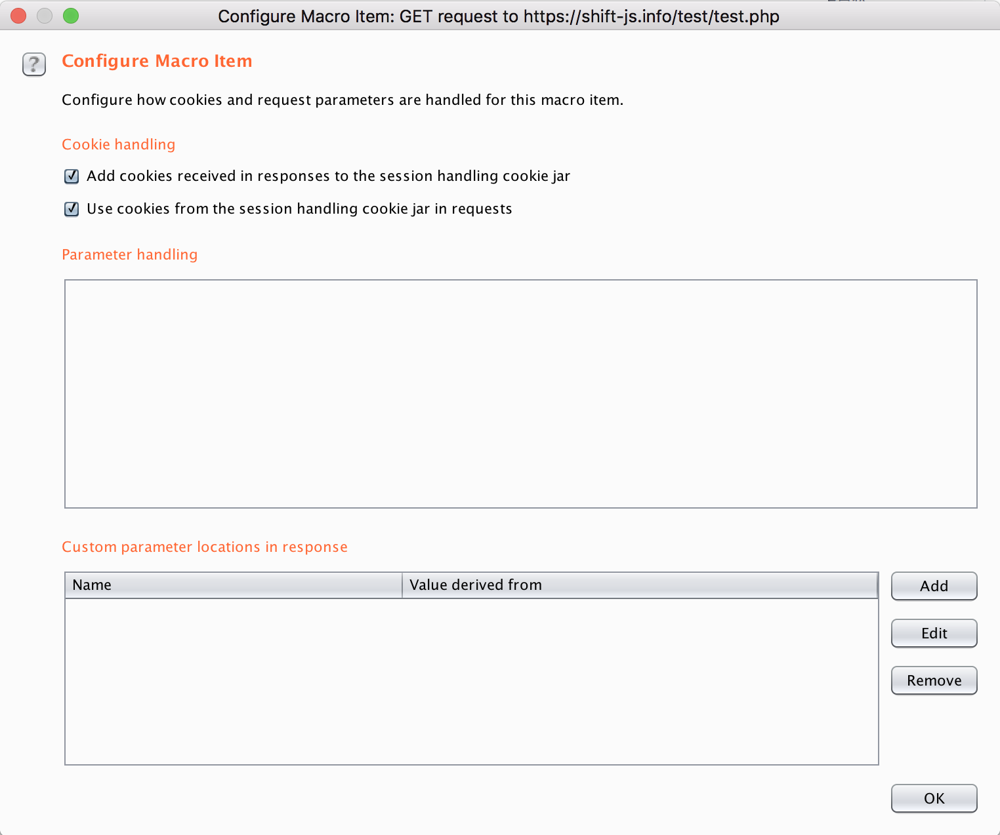

# What does this extender do ?
1. Store CSRF Tokens which satisfy the preset regex from macro/proxy responses automatically.
2. Send CSRF Tokens with the stored token with a custom HTTP Header (this feature is not available with vanilla Burp Suite Professional).

# How to use

1. Install and enable this script with your Burp Suite Professional.
2. Set the scope in which you want to send HTTP Header with CSRF Token by right-clicking in the some tabs or directly inputting regexp. (e.g. ```^https://shift-js.info:433/*``` . please make sure every scope includes a port.)
3. Set the regexp which matches the source of CSRF Tokens of the website you're testing.
4. If necessary, set the custom header name with which you want to send a token in the HTTP header.
5. Set a macro which makes Burp to access to the source of the CSRF Token before accessing to the page you're testing. *NOTE* there's no need to configure parameter handling rules (see the images below).
6. Have happy testing :-)

Here's a sample for this PHP script put on https://shift-js.info/test/test.php (now this link is invalid):
```
<?php
session_start();
if (isset($_SERVER['HTTP_X_CSRF_TOKEN']) && $_SERVER['HTTP_X_CSRF_TOKEN'] == $_SESSION['csrf-token']) {
   echo 'GOOD :-)';
} else {
   echo 'Umm... There\'s something wrong.';
}
$_SESSION['csrf-token'] = sha1('hogehoge_' . microtime());
echo '<br />Here\'s your new token: ' . $_SESSION['csrf-token'];
?>
```

|")|
|:--:|
|2: Add to the scope from Target tab (This can be done in other tabs)|

||
|:--:|
|3,4: Set parameters to fetch a CSRF Token and send it in the HTTP header and enable/disable the extender separately for each tool|

||
|:--:|
|5(1): Set a macro for test.php|

||
|:--:|
|5(2): There's no need to set any parameters to override or fetch; it's automated|

||
|:--:|
|When this extender is enabled|


# Limitations

1. This extender can deal with only one thread tasks; two-thread scanning won't be fine.
   - Is there any way to know from which session handling rule a request was made?
   
# Environment
I checked it works in the following environment:

- Burp 1.7.30
- Mac OS Sierra
- Jython 2.7.0
- java version "1.8.0_144"
- Java(TM) SE Runtime Environment (build 1.8.0_144-b01)
- Java HotSpot(TM) 64-Bit Server VM (build 25.144-b01, mixed mode)
